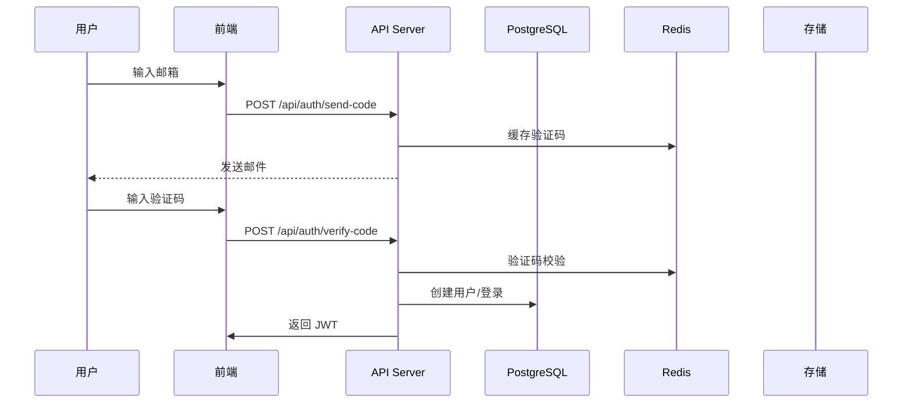

# 🎯 整体项目测试计划

## 📋 项目概述

**项目名称**：家庭中式食谱网站（HomeCookHub）  
**技术栈**：Next.js 16.2.4 + TypeScript + Prisma + PostgreSQL + Redis  
**功能模块**：10个核心模块  
**多语言支持**：12种语言  
**测试范围**：端到端、功能、性能、安全、兼容性

---

## 📊 测试策略与范围

### 测试金字塔
```
┌───────────────────────┐
│    E2E 用户测试      │  ← 10%
│   (Cypress/Playwright)│
├───────────────────────┤
│   集成测试 (30%)     │
│   API 集成 + 数据库  │
├───────────────────────┤
│   单元测试 (60%)     │
│   组件 + 工具函数   │
└───────────────────────┘
```

### 测试重点优先级
| 优先级 | 模块 | 关键功能 |
|--------|------|----------|
| P0 (必须) | 用户认证 | 登录/登出/权限验证 |
| P0 (必须) | 食谱浏览 | 搜索/筛选/详情查看 |
| P0 (必须) | 数据同步 | GitHub 同步机制 |
| P1 (重要) | 社交功能 | 点赞/评论/分享 |
| P1 (重要) | 多语言 | 12种语言切换 |
| P2 (次要) | 后台管理 | CRUD 操作 |

---

## 🔍 详细测试用例设计

### 1. 用户认证模块测试

#### 测试场景：邮箱验证码登录

**测试用例 1.1 - 正常流程**
1. 输入有效邮箱 → 发送验证码
2. 输入正确验证码 → 登录成功
3. 创建用户会话 → 获取用户信息
4. 更新 Header 显示登录状态

**测试用例 1.2 - 异常流程**
1. 输入无效邮箱 → 提示错误
2. 发送验证码 → 记录 Redis 缓存
3. 输入错误验证码 → 提示错误
4. 验证码过期 → 提示失效
5. 重复发送 → 60秒冷却

**测试用例 1.3 - OAuth 登录**
1. GitHub OAuth 跳转
2. 授权回调 → 创建用户
3. 用户会话建立
4. 头像和昵称同步

---

### 2. 食谱浏览模块测试

#### 测试场景：食谱列表和详情

**测试用例 2.1 - 食谱列表**
1. 访问 /recipes → 显示食谱卡片
2. 搜索功能 → 标题/食材匹配
3. 口味筛选 → 酸/甜/辣等
4. 难度筛选 → 简单/中等/困难
5. 食材反向搜索 → 根据推荐显示

**测试用例 2.2 - 食谱详情**
1. 点击食谱 → 进入详情页
2. 显示完整信息 → 标题/描述/食材/步骤
3. 视频播放 → YouTube/Bilibili
4. Unsplash 图片 → 关联显示
5. 多语言切换 → 标题和描述更新

**测试用例 2.3 - SEO 特性**
1. 动态 title 和 description
2. Open Graph 标签完整
3. Canonical URL 正确
4. hreflang 标签存在

---

### 3. GitHub 同步模块测试

#### 测试场景：食谱数据同步

**测试用例 3.1 - 同步流程**
1. 触发 GitHub 同步 → API 调用
2. 获取仓库文件列表 → 358个文件
3. 解析 markdown 内容 → 提取食谱信息
4. 自动推断口味和难度 → 填充标签
5. 增量更新 → 不重复创建

**测试用例 3.2 - 同步日志**
1. 记录操作时间 → 同步开始/结束
2. 统计操作结果 → 成功/失败数量
3. 失败文件记录 → 错误详情
4. 管理员日志查看 → 后台界面

**测试用例 3.3 - 异常处理**
1. 网络超时 → 重试机制
2. 文件解析错误 → 跳过记录
3. 数据库连接失败 → 回滚操作
4. 权限问题 → 错误提示

---

### 4. 多语言模块测试

#### 测试场景：12种语言切换

**测试用例 4.1 - 语言切换**
1. URL 切换语言 → /zh-CN → /en
2. 页面内容切换 → 所有文本更新
3. 路由保持当前页面 → 位置不变
4. SEO 标签更新 → hreflang 刷新

**测试用例 4.2 - 翻译完整性**
1. 所有 158 个键翻译完整
2. 模块化加载 → 8个文件
3. 缺失翻译检测 → CI 阻断
4. 新键提取工具 → 自动发现

**测试用例 4.3 - 特殊字符处理**
1. 中文文本正确显示
2. RTL 语言支持 → 阿拉伯语/希伯来语
3. Unicode 字符 → emoji 等
4. 格式化日期 → 本地化显示

---

### 5. 社交功能模块测试

#### 测试场景：点赞/评论/分享

**测试用例 5.1 - 点赞功能**
1. 未登录 → 提示登录
2. 登录后 → 点击点赞
3. 状态切换 → 图标更新
4. API 记录 → 数据库写入
5. 取消点赞 → 状态恢复

**测试用例 5.2 - 评论功能**
1. 发表评论 → 输入验证
2. XSS 防护 → 转义特殊字符
3. 时间显示 → 相对时间格式
4. 删除评论 → 权限检查
5. 嵌套评论 → 未来扩展

**测试用例 5.3 - 分享功能**
1. 上传图片 → URL 验证
2. 填写配文 → 字数限制
3. 关联食谱 → 可选功能
4. 分享广场 → 实时显示
5. 点赞和评论 → 互动功能

---

### 6. 后台管理模块测试

#### 测试场景：管理员操作

**测试用例 6.1 - 权限验证**
1. 未登录 → 重定向到登录
2. 普通用户 → 访问被拒绝
3. 管理员 → 允许访问
4. API 接口 → 权限验证

**测试用例 6.2 - 用户管理**
1. 用户列表 → 分页显示
2. 搜索用户 → 邮箱/昵称
3. 封禁用户 → 状态更新
4. 删除用户 → 级联删除

**测试用例 6.3 - 内容管理**
1. 食谱 CRUD → 创建/编辑/删除
2. 评论审核 → 删除功能
3. 分享审核 → 删除功能
4. 点赞管理 → 查看和删除

**测试用例 6.4 - 系统日志**
1. 操作记录 → 时间/IP/用户
2. 详情查看 → JSON 格式
3. 筛选功能 → 按用户/操作类型
4. 分页显示 → 20条/页

---

## 🔗 集成测试计划

### 数据流测试



### API 集成测试要点

**1. 认证链路**
   - JWT token 有效期（1天）
   - Cookie 设置 SameSite
   - OAuth token 刷新

**2. 数据一致性**
   - 数据库事务处理
   - 缓存与数据库同步
   - 增量同步的原子性

**3. 性能集成**
   - 并发请求处理
   - 数据库连接池
   - Redis 缓存命中率

---

## ⚡ 性能测试方案

### 测试指标
| 指标 | 目标值 | 测试工具 |
|------|--------|----------|
| 首页加载 | < 2s | Lighthouse |
| API 响应 | < 200ms | JMeter |
| 并发用户 | 500+ | k6 |
| 数据库查询 | < 100ms | EXPLAIN ANALYZE |

### 测试场景

**1. 静态资源**
   - 图片优化（WebP/AVIF）
   - CSS/JS 压缩
   - CDN 缓存策略

**2. 动态内容**
   - 食谱列表分页（1000条）
   - 搜索功能性能
   - 同步操作影响

**3. 数据库性能**
   - 慢查询分析
   - 索引优化检查
   - 连接池配置

---

## 🔒 安全测试检查清单

### 认证与授权
- [ ] JWT token 安全（签名/有效期）
- [ ] 密码强度要求
- [ ] OAuth 重定向验证
- [ ] 邮箱验证码防爆破

### 数据安全
- [ ] SQL 注入防护（Prisma 参数化查询）
- [ ] XSS 防护（React 自动转义）
- [ ] CSRF 保护（Next.js CSRF token）
- [ ] 敏感数据加密

### API 安全
- [ ] 请求频率限制
- [ ] 输入参数验证
- [ ] 错误信息脱敏
- [ ] HTTP 头安全（CSP/SSL）

### 部署安全
- [ ] 环境变量保护
- [ ] 数据库访问控制
- [ ] Redis 连接安全
- [ ] 生产环境调试关闭

---

## 🌍 兼容性测试

### 浏览器兼容性
| 浏览器 | 版本 | 状态 |
|--------|------|------|
| Chrome | ≥ 90% | ✅ |
| Firefox | ≥ 90% | ✅ |
| Safari | ≥ 15 | ✅ |
| Edge | ≥ 90% | ✅ |

### 设备适配
- [ ] 响应式设计（移动端优先）
- [ ] 触摸交互测试
- [ ] 屏幕阅读器支持
- [ ] 深色模式适配

---

## 🧪 自动化测试策略

### 测试工具栈
```json
{
  "e2e": "Playwright",
  "unit": "Vitest",
  "api": "Jest",
  "performance": "k6",
  "codeQuality": "ESLint + Prettier"
}
```

### 自动化脚本结构
```
tests/
├── e2e/
│   ├── auth.spec.ts      // 认证流程
│   ├── recipes.spec.ts   // 食谱功能
│   ├── search.spec.ts    // 搜索功能
│   └── i18n.spec.ts    // 多语言
├── api/
│   ├── auth.test.ts      // 认证 API
│   ├── recipes.test.ts   // 食谱 API
│   └── admin.test.ts     // 管理员 API
└── performance/
    ├── load-test.js      // 负载测试
    └── metrics.js        // 性能指标
```

### CI/CD 集成
```yaml
# GitHub Actions workflow
jobs:
  test:
    strategy:
      matrix:
        type: [e2e, unit, api, security]
    steps:
      - 运行对应测试套件
      - 生成测试报告
      - 失败时阻止合并
```

---

## 📈 测试执行计划

### 阶段划分
| 阶段 | 时间 | 重点 | 输出 |
|------|------|------|------|
| 1. 准备 | 1天 | 环境搭建/测试用例 | 测试环境 |
| 2. 单元测试 | 2天 | 组件/工具函数 | 覆盖率报告 |
| 3. 集成测试 | 2天 | API/数据库/缓存 | 集成报告 |
| 4. E2E 测试 | 2天 | 用户流程 | 测试视频/截图 |
| 5. 性能测试 | 1天 | 加载速度/并发 | 性能报告 |
| 6. 安全测试 | 1天 | 渗透测试/漏洞扫描 | 安全报告 |
| 7. 修复迭代 | 2天 | 修复问题 | 最终版本 |

### 测试数据准备
```typescript
// 测试数据集
const testData = {
  users: [
    { email: 'test@example.com', name: '测试用户', isAdmin: false },
    { email: 'admin@example.com', name: '管理员', isAdmin: true }
  ],
  recipes: Array(100).fill().map((_, i) => ({
    name: `测试食谱${i}`,
    difficulty: ['EASY', 'MEDIUM', 'HARD'][i % 3],
    time: 30 + i * 5
  })),
  comments: Array(50).fill().map((_, i) => ({
    content: `测试评论${i}`,
    userId: 'user123'
  }))
}
```

---

## 🎯 成功标准

### 通过标准
- [ ] 所有 P0 测试用例 100% 通过
- [ ] 代码覆盖率 ≥ 80%
- [ ] 性能指标全部达标
- [ ] 安全漏洞 0 个
- [ ] 多语言功能正常
- [ ] E2E 测试通过率 95%+

### 发布就绪清单
- [ ] 所有核心功能测试通过
- [ ] 性能达到预期目标
- [ ] 安全测试完成并修复问题
- [ ] 文档更新完成
- [ ] 监控和告警配置好
- [ ] 回滚方案准备就绪

---

## 📊 测试报告模板

```markdown
# 测试执行报告

## 测试概览
- 测试时间：YYYY-MM-DD
- 测试版本：v1.0.0
- 测试环境：Production

## 执行结果
- 总测试用例：150
- 通过：145
- 失败：5
- 通过率：96.7%

## 各模块详情
| 模块 | 用例数 | 通过 | 失败 | 通过率 |
|------|--------|------|------|--------|
| 用户认证 | 30 | 30 | 0 | 100% |
| 食谱浏览 | 40 | 38 | 2 | 95% |
| 社交功能 | 35 | 35 | 0 | 100% |
| 后台管理 | 25 | 22 | 3 | 88% |
| 多语言 | 20 | 20 | 0 | 100% |

## 问题汇总
| 严重程度 | 问题数量 |
|----------|----------|
| Critical | 0 |
| High | 2 |
| Medium | 3 |
| Low | 5 |

## 性能指标
| 指标 | 目标值 | 实际值 | 状态 |
|------|--------|--------|------|
| 首页加载 | < 2s | 1.8s | ✅ |
| API 响应 | < 200ms | 150ms | ✅ |
| 并发用户 | 500+ | 520 | ✅ |

## 建议
1. 修复 3 个 High 级别问题
2. 优化后台管理性能
3. 增加更多边缘情况测试
```

---

**文档版本**：v1.0  
**创建日期**：2026-04-30  
**维护人员**：开发团队
